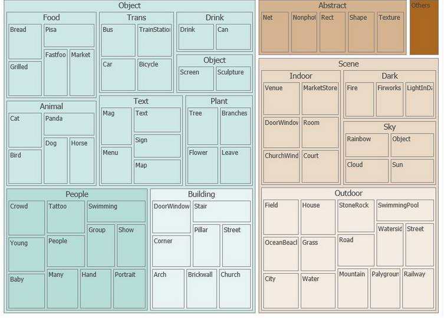
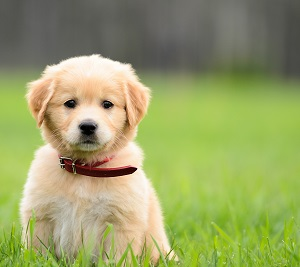
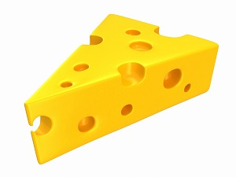
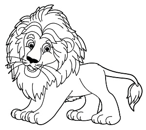
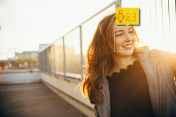
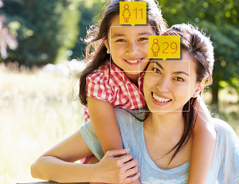
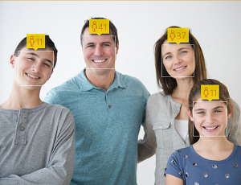

<!-- 
NavPath: Computer Vision API
LinkLabel: Analyze Image
Url: Computer-Vision-API/documentation/AnalyzeImage
Weight: 100
-->

# Analyzing an Image Version 1.0

Through Vision API a user can analyze and filter visual content in numerous ways, use optical character recognition to identify text found in images, distinguish color schemes, and crop photos to be used as thumbnails. 

a)###	Tagging images
Tagging is a new way of analyzing an image. Vision API can return tags based on objects, living beings, scenery or actions found in images. Tags are not returned according to a hierarchical classification system, but correspond to image content. Tags may contain hints to avoid ambiguity or provide context, for example the tag “cello” may be accompanied by the hint “musical instrument”. All tags are in English.

b)###	Generating descriptions
A collection of content tags forms the foundation for an image “description” displayed as human readable language in complete sentences. More than one description will be generated for each image ordered by their confidence score. All descriptions are in English.

c)###	Categorizing images 
In addition to tagging and descriptions, Vision API continues returning the taxonomy-based categories defined in our previous version.  These categories are organized as a taxonomy with parent/child hereditary hierarchies. All categories are in English, and you can find the full taxonomy [here](https://www.projectoxford.ai/images/bright/vision/examples/86categories.txt).

d)###	Recognizing domain-specific content: Celebrities model
A new domain-specific model has been added to Vision API, in this case a model that recognizes celebrities in your images. It can be implemented as a stand-alone method or in combination with the top-level image categorization. 

e)###	Flagging adult content
Among the various visual categories is the adult and racy group, which enables detection of pornographic materials and restricts the display of images containing sexual content. The filter for pornographic detection can be set on a sliding scale to accommodate the user’s preference.

f)###	Perceiving color schemes
The Computer Vision algorithm extracts colors from an image. The colors are analyzed in three different contexts, foreground, background, and whole, and colors are grouped into twelve 12 dominant accent colors (black, blue, brown, gray, green, orange, pink, purple, red, teal, white, and yellow). Depending on the colors in an image, simple black and white or accent colors may be returned in hexadecimal color codes.

g)###	Identifying image types
There are several ways to categorize images. Vision API can set a boolean flag to indicate whether an image is black and white or color and use the same method to indicate whether an image is a line drawing or not. It can also indicate whether an image is clipart or not and indicate its quality as such on a scale of 0-3. 

h)###	Detecting faces
Vision API detects human faces within a picture and generates face coordinates, draws the bounding box around the face, indicates gender and age. These visual features are a subset of metadata generated for Face API. For more extensive metadata generated for faces, such as facial identification, pose detection, and more, use the Face API.

For a hands on experience with any of the visual features, thumbnail generation, and OCR, please go to the  [interactive demo](https://www.projectoxford.ai/demo/vision). 

#### 86-category concept

Based on a list of 86 concepts seen in the below diagram, visual features found in an image can be categorized ranging from broad to specific. For the full taxonomy in text format, follow this [link](https://www.projectoxford.ai/images/bright/vision/examples/86categories.txt).  
  

Image                                                                           | Response
------------------------------------------------------------------------------- | ----------------
                                   | people_
                               | people_crowd
                                       | animal_dog
                       | outdoor_mountain
 | food_bread

## Color
### DominantColor
The dominant color name extracted from an image intended to match a user's perception. The feature is computed in 3 different contexts: foreground, background, and overall dominant colors. Colors are grouped into 12 color names -- black, blue, brown, grey, green, orange, pink, purple, red, white, yellow, and teal.  

Image                                                                                 | Foregroud |Backgroud| Colors
------------------------------------------------------------------------------------- | --------- | ------- | ------
                             | Black     | Black   | White
                 | Black     | White   | White,Black,Green
 | Black     | Black   | Black

## Accent color
Color extracted from an image designed to represent the most eye-popping color to users via a mix of dominant colors and saturation.  

Image                                                                                 | Response
------------------------------------------------------------------------------------- | ----
                             | #BC6F0F
                 | #CAA501
 | #484B83

## Black & White
Boolean flag that indicates whether an image is black&white or not.  

Image                                                                                 | Response
------------------------------------------------------------------------------------- | ----
             | True
       | False

## ImageType
### Clipart type
Detects whether an image is clipart or not.  

Value | Meaning
----- | --------------
0     | Non-clipart
1     | ambiguous
2     | normal-clipart
3     | good-clipart

Image|Response
----|----
|3 good-clipart
|0 Non-clipart

## Line drawing type
Detects whether an image is a line drawing or not.  

Image|Response
----|----
|True
|False

## Faces
Detects human faces within a picture and generates the face coordinates, the rectangle for the face, gender, and age. These visual features are a subset of metadata generated for face. For more extensive metadata generated for faces (facial identification, pose detection, and more), please use the Face API here.  

Image|Response
----|----
 | [ { "age": 23, "gender": "Female", "faceRectangle": { "left": 1379, "top": 320, "width": 310, "height": 310 } } ]
 | [ { "age": 28, "gender": "Female", "faceRectangle": { "left": 447, "top": 195, "width": 162, "height": 162 } }, { "age": 10, "gender": "Male", "faceRectangle": { "left": 355, "top": 87, "width": 143, "height": 143 } } ] 
 | [ { "age": 11, "gender": "Male", "faceRectangle": { "left": 113, "top": 314, "width": 222, "height": 222 } }, { "age": 11, "gender": "Female", "faceRectangle": { "left": 1200, "top": 632, "width": 215, "height": 215 } }, { "age": 41, "gender": "Male", "faceRectangle": { "left": 514, "top": 223, "width": 205, "height": 205 } }, { "age": 37, "gender": "Female", "faceRectangle": { "left": 1008, "top": 277, "width": 201, "height": 201 } } ] 
