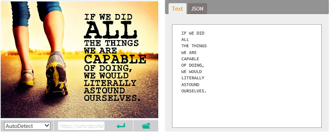

<!-- 
NavPath: Computer Vision API
LinkLabel: OCR
Url: Computer-Vision-API/documentation/OCR
Weight: 80
-->

# Optical Character Recognition (OCR)

Optical Character Recognition (OCR) is a technology that detects text content in an image and subsequently extracts the identified text into a machine-readable character stream used for search and numerous other purposes ranging from medical records to security and banking. It automatically detects the language. The 21 languages supported by OCR are Chinese Simplified, Chinese Traditional, Czech, Danish, Dutch, English, Finnish, French, German, Greek, Hungarian, Italian, Japanese, Korean, Norwegian, Polish, Portuguese, Russian, Spanish, Swedish, and Turkish. 

If needed, OCR corrects the rotation of the recognized text, in degrees, around the horizontal image axis. OCR provides the frame coordinates of each word as seen in below illustration.

###Requirements for OCR:
1.	The size of the input image must be between 40 x 40 and 32000 x 32000 pixels. 
2.	The image cannot be bigger than 100 megapixels.
3.	Input image can be rotated by any multiple of 90 degrees plus a small angle of up to ±40 degrees.
4.	The accuracy of text recognition depends on the quality of the image. An inaccurate reading may be caused by the following:
  * Blurry images
  * Handwritten or cursive text
  * Artistic font styles
  * Small text size
  * Complex backgrounds, shadows or glare over text or perspective distortion
  * Oversized or missing capital letters at the beginnings of words
  * Subscript, superscript, or strikethrough text
5.	Limitations: On photos where text is dominant, false positives may come from partially recognized words. On some photos, especially photos without any text, precision can vary a lot depending on the type of image.

