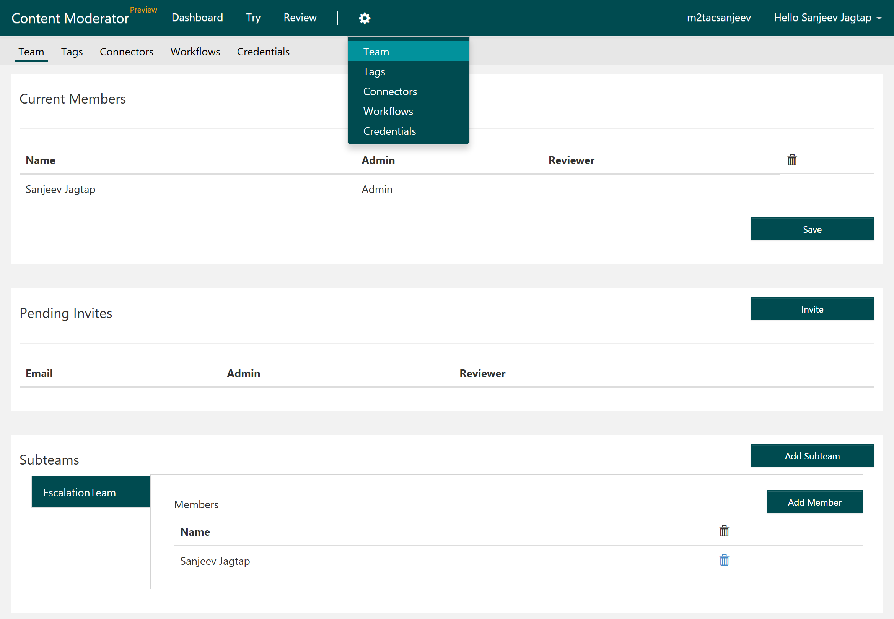
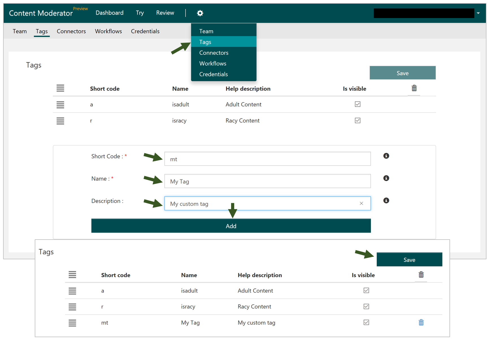
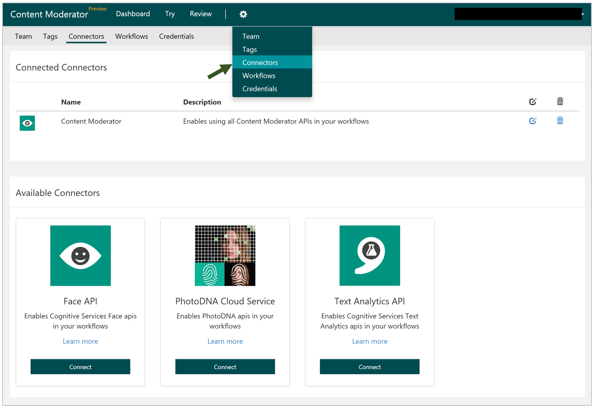
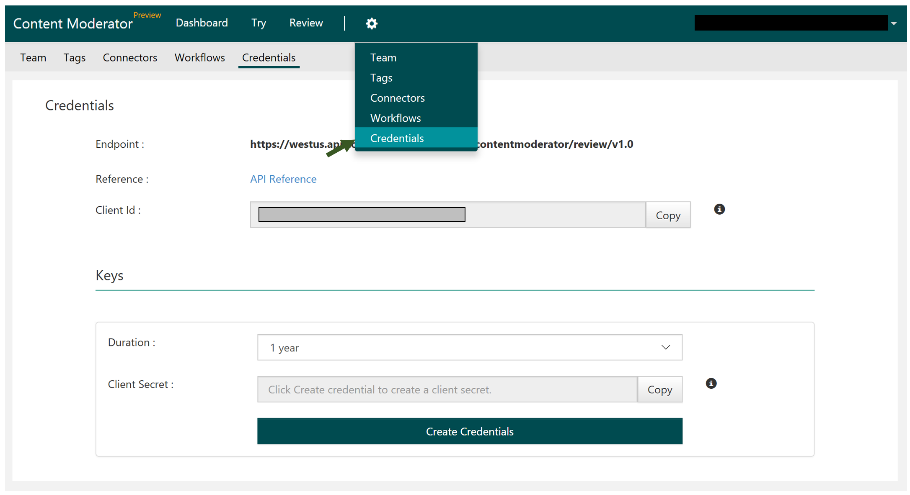

<!-- 
NavPath: Content Moderator/Review Tool User Guide
LinkLabel: Settings
Url: content-moderator/documentation/review-tool-user-guide/settings
Weight: 15
-->

# Configure Settings #

## Team ##

After you have sent out invites, you can monitor them, change permissions for team members, and invite additional users on the screens shown below. You can also create subteams and assign existing members. The users can be either administrators or reviewers. The difference between the two roles is that administrators can invite other users, while reviewers cannot.

## Tags ##

This is where you can define your custom tags by entering the short code, name, and description for your tags and using the **Add** button. You will see your new tag on the screen. Click the **Save** button to save your new tag and make it available during reviews.

## Connectors ##

The Content Moderator review tool calls the Content Moderator APIs with the **default** workflow to moderate content. It will auto-provision the Moderator API credentials for you when you sign up for the review tool. 

It also supports integrating other APIs as long as a connector is available. We have made a few connectors available out of the box. You can enter your credentials for these APIs by using the **Connect** button. You can then use these connectors in your custom workflows, as shown in the next section.

## Workflows ##

This is where you can see the **default** workflow. You can also define custom workflows for image and text by using the API Connectors available under the Connectors section. For a detailed example of how to define custom workflows, please see the **[Workflows](workflows.md)** section.

## Credentials ##

In this section, you can access your Review API credentials (Client Id and Client Secret) that you will use to integrate your content with the review tool. Please see 

