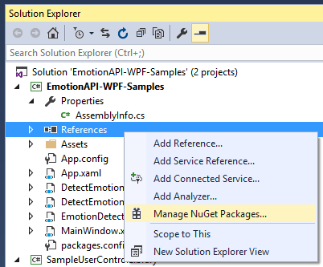
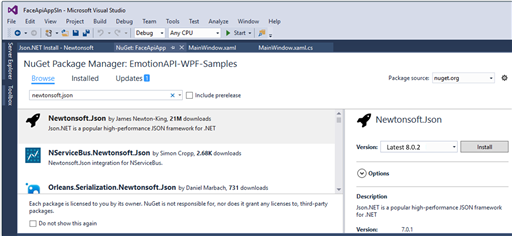

<!--
NavPath: Emotion API
LinkLabel: Get Started with Emotion API in C#
Url: Emotion-api/documentation/GetStarted
Weight: 99
-->

# Get Started with Emotion API in C&#35;
 
 

Explore a basic Windows application that uses Emotion API to recognize the emotions expressed by the faces in an image. The below example lets you submit an image URL or a locally stored file. You can use this open source example as a template for building your own app for Windows using the Emotion API and WPF (Windows Presentation Foundation), a part of .NET Framework.
## Table of Contents
[Prerequisites](#Prerequisites)  
[Step 1: Open the example](#Step1)  
[Step 2: Build the example](#Step2)  
[Step 3: Run the example](#Step3)  
[Review and Learn](#Review)  

## <a name="Prerequisites">Prerequisites</a>
#### Platform requirements  

  The below example has been developed for the .NET Framework using [Visual Studio 2015, Community Edition](https://www.visualstudio.com/products/visual-studio-community-vs).  
#### Subscribe to Emotion API and get a subscription key  

  Before creating the example, you must subscribe to Emotion API which is part of the Microsoft Project Oxford services. See [Subscriptions](https://www.microsoft.com/cognitive-services/en-us/sign-up). Both the primary and secondary key can be used in this tutorial. Make sure to follow best practices for keeping your API key secret and secure.  
#### Get the client library and example  

  You may download the Emotion API client library and example through [https://www.projectoxford.ai/sdk](https://www.projectoxford.ai/sdk) or access them via [GitHub](https://github.com/Microsoft/ProjectOxford-ClientSDK/tree/master/Emotion/Windows). The downloaded zip file needs to be extracted to a folder of your choice, many users choose the Visual Studio 2015 folder.

## <a name="Step1">Step 1: Open the example</a>
1.	Start Microsoft Visual Studio 2015 and click **File**, select **Open**, then **Project/Solution**.
2.	Browse to the folder where you saved the downloaded Emotion API files. Click on **Emotion**, then **Windows**, and then the **Sample-WPF** folder.
3.	Double-click to open the Visual Studio 2015 Solution (.sln) file named **EmotionAPI-WPF-Samples.sln**. This will open the solution in Visual Studio.

## <a name="Step2">Step 2: Build the example</a>
1. In **Solution Explorer**, right click **References** and select **Manage NuGet Packages**.   

2.	The **NuGet Package Manager** window opens. First select **Browse** in the upper left corner, then in the search box type “Newtonsoft.Json”, select the **Newtonsoft.Json** package and click **Install**.    
  
3.	Press Ctrl+Shift+B, or click **Build** on the ribbon menu, then select **Build Solution**.

## <a name="Step3">Step 3: Run the example</a>
1.	After the build is complete, press **F5** or click **Start** on the ribbon menu to run the example.
2.	Locate the Emotion API window with the **text box** reading "**Paste your subscription key here to start**". Paste your subscription key into the text box as shown in below screenshot. You can choose to persist your subscription key on your PC or laptop by clicking the "Save Key" button. When you want to delete the subscription key from the system, click "Delete Key" to remove it from your PC or laptop.  

3.	Under "**Select Scenario**" click to use either of the two scenarios, “**Detect emotion using a stream**” or “**Detect emotion using a URL**”, then follow the instructions on the screen. Microsoft receives the images you upload and may use them to improve Emotion API and related services. By submitting an image, you confirm that you have followed our [Developer Code of Conduct](http://research.microsoft.com/en-us/UM/legal/ProjectOxford_CodeOfConduct.htm).
4.	There are example images to be used with this example application. You can find these images on [Github](https://github.com/Microsoft/ProjectOxford-ClientSDK/tree/master/Face/Windows/Data) under **Face**, **Windows**, then search the **Data** folder. Please note the use of these images is licensed under Fair Use agreement meaning they are OK to use for testing this example, but not for republishing.
## <a name="Review">Review and Learn</a>
Now that you have a running application, let us review how this example app integrates with Project Oxford technology. This will make it easier to either continue building onto this app or develop your own app using Project Oxford’s Emotion API. 


## <a name="Review">Review and Learn</a>
Now that you have a running application, let us review how this example app integrates with Project Oxford technology. This will make it easier to either continue building onto this app or develop your own app using Project Oxford’s Emotion API. 

This example app makes use of the Emotion API Client Library, a thin C# client wrapper for the Project Oxford Emotion API. When you built the example app as described above, you got the Client Library from a NuGet package. You can review the Client Library source code in the folder titled “[Client Library](https://github.com/Microsoft/ProjectOxford-ClientSDK/tree/master/Emotion/Windows/ClientLibrary)” under **Emotion**, **Windows**, **Client Library**, which is part of the downloaded file repository mentioned above in [Prerequisites](#Prerequisites).
 
You can also find out how to use the Client Library code in **Solution Explorer**: Under **EmotionAPI-WPF_Samples**, expand **DetectEmotionUsingStreamPage.xaml** to locate **DetectEmotionUsingStreamPage.xaml.cs**, which is used for browsing to a locally stored file, or expand **DetectEmotionUsingURLPage.xaml** to find **DetectEmotionUsingURLPage.xaml.cs**, which is used when uploading an image URL. Double-click the .xaml.cs files to have them open in new windows in Visual Studio. 

Reviewing how the Emotion Client Library gets used in our example app, let's look at two code snippets from **DetectEmotionUsingStreamPage.xaml.cs** and **DetectEmotionUsingURLPage.xaml.cs**. Each file contains code comments indicating “KEY SAMPLE CODE STARTS HERE” and “KEY SAMPLE CODE ENDS HERE” to help you locate the code snippets reproduced below.

The Emotion API is able to work with either an image URL or binary image data (in form of an octet stream) as input. The two options are reviewed below. In both cases, you first find a using directive, which lets you use the Emotion Client Library. 


```csharp

            // ----------------------------------------------------------------------- 
            // KEY SAMPLE CODE STARTS HERE 
            // Use the following namespace for EmotionServiceClient 
            // ----------------------------------------------------------------------- 
            using Microsoft.ProjectOxford.Emotion; 
            using Microsoft.ProjectOxford.Emotion.Contract; 
            // ----------------------------------------------------------------------- 
            // KEY SAMPLE CODE ENDS HERE 
            // ----------------------------------------------------------------------- 
```
#### DetectEmotionUsingURLPage.xaml.cs 

This code snippet shows how to use the Client Library to submit your subscription key and a photo URL to the Emotion API service. 

```csharp

            // -----------------------------------------------------------------------
            // KEY SAMPLE CODE STARTS HERE
            // -----------------------------------------------------------------------

            window.Log("EmotionServiceClient is created");

            //
            // Create Project Oxford Emotion API Service client
            //
            EmotionServiceClient emotionServiceClient = new EmotionServiceClient(subscriptionKey);

            window.Log("Calling EmotionServiceClient.RecognizeAsync()...");
            try
            {
                //
                // Detect the emotions in the URL
                //
                Emotion[] emotionResult = await emotionServiceClient.RecognizeAsync(url);
                return emotionResult;
            }
            catch (Exception exception)
            {
                window.Log("Detection failed. Please make sure that you have the right subscription key and proper URL to detect.");
                window.Log(exception.ToString());
                return null;
            }
            // -----------------------------------------------------------------------
            // KEY SAMPLE CODE ENDS HERE
            // -----------------------------------------------------------------------
```
#### DetectEmotionUsingStreamPage.xaml.cs 

Shown below is how to submit your subscription key and a locally stored image to the Emotion API. 


```csharp


            // -----------------------------------------------------------------------
            // KEY SAMPLE CODE STARTS HERE
            // -----------------------------------------------------------------------

            //
            // Create Project Oxford Emotion API Service client
            //
            EmotionServiceClient emotionServiceClient = new EmotionServiceClient(subscriptionKey);

            window.Log("Calling EmotionServiceClient.RecognizeAsync()...");
            try
            {
                Emotion[] emotionResult;
                using (Stream imageFileStream = File.OpenRead(imageFilePath))
                {
                    //
                    // Detect the emotions in the URL
                    //
                    emotionResult = await emotionServiceClient.RecognizeAsync(imageFileStream);
                    return emotionResult;
                }
            }
            catch (Exception exception)
            {
                window.Log(exception.ToString());
                return null;
            }
            // -----------------------------------------------------------------------
            // KEY SAMPLE CODE ENDS HERE
            // -----------------------------------------------------------------------
```
<!--
## <a name="Related">Related Topics</a>
[Emotion API Overview](.)
-->


