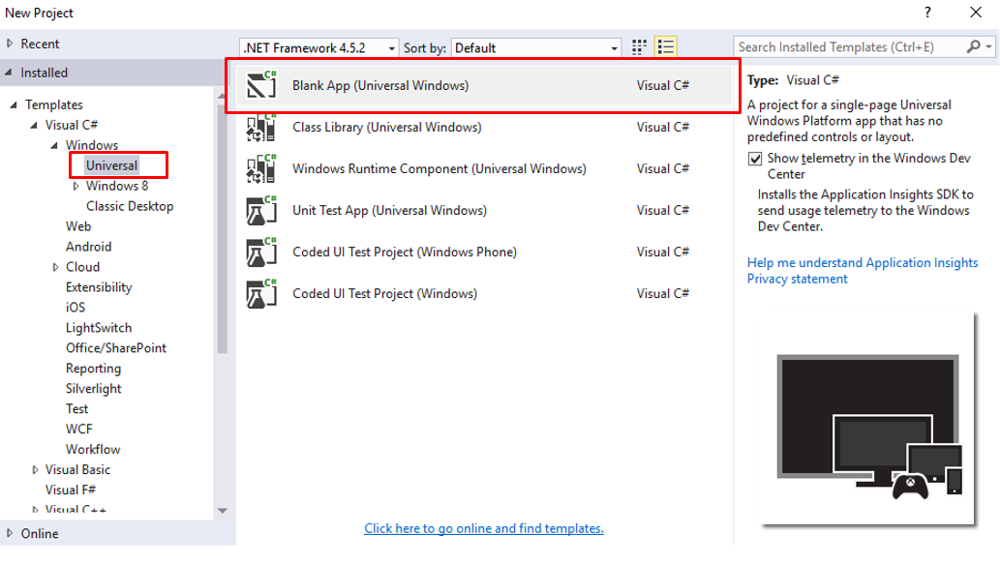
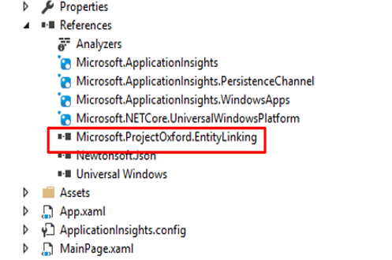
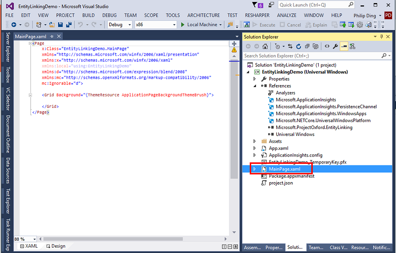
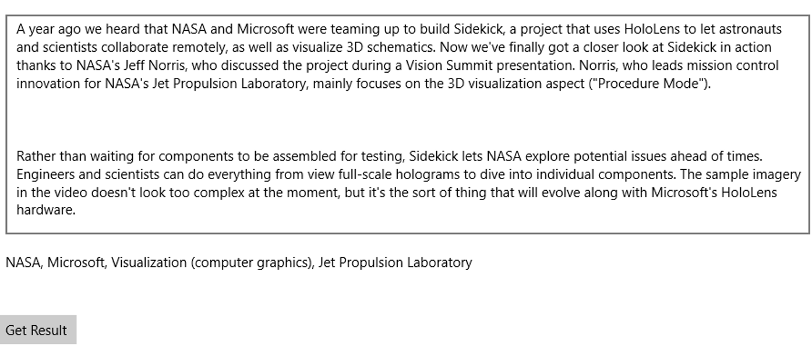

<!--
NavPath: Entity Linking API
LinkLabel: Getting Started with EntityLinking API in C#
Url: entitylinking-api/documentation/GettingStarted
Weight: 1
-->

# Getting Started with Entity Linking API in C# #

Project Oxford Entity Linking is a natural language processing tool to help analyzing text for your application. It is quite common to aligning a textual mention of a named-entity to an appropriate entry in a knowledge base. 

In this tutorial, you will explore entity linking by adding Entity Linking library via NuGet 

## Table of Contents

- [Prerequisites](#prerequisites)
- [Step 1: Subscribe Entity Linking Intelligence Service and get your own key](#step-1-subscribe-entity-linking-intelligence-service-and-get-your-own-key)
- [Step 2: Create a new project in Visual Studio](#step-2-create-a-new-project-in-visual-studio)
- [Step 3: Add the Entity Linking NuGet Package to your project](#step-3-add-the-entity-linking-nuget-package-to-your-project)
- [Step 4: Add an input and output text block to your app’s XAML](#step-4-add-an-input-and-output-text-block-to-your-apps-xaml)
- [Step 5: Proceed to add Entity Linking Intelligence Service](#step-5-proceed-to-add-entity-linking-intelligence-service)
- [Summary](#summary)
- [Related Topics](#related-topics)


## Prerequisites

- Visual Studio 2015
- Project Oxford Entity Linking NuGet Package
- A Project Oxford API Key

* Get the client library and example

You may download the Entity Linking Intelligence Service API client library through https://www.projectoxford.ai/sdk or access them via GitHub. The downloaded zip file needs to be extracted to a folder of your choice, many users choose the Visual Studio 2015 folder.


## Step 1: Subscribe Entity Linking Intelligence Service and get your own key
Before using any Face API, you must sign up to subscribe Face API of the Microsoft Project Oxford services. See [subscription and key management](https://www.projectoxford.ai/Subscription). Both primary and secondary key can be used in this tutorial.

## Step 2: Create a new project in Visual Studio

Let’s start by creating a new project in Visual Studio.
First, launch Visual Studio 2015 from the Start Menu. Then, create a new project by select ** Installed → Templates → Visual C# → Windows Universal → Blank App ** for your project template:

 

## Step 3: Add the Entity Linking NuGet Package to your project

Entity Linking of Project Oxford is released as a Nuget.org package and needs to be installed before you can use it.
To add them to your project, go to the Solution Explorer tab, ** right click ** on your project, and select ** Manage Nuget Packages **:

In NuGet Package Manager window, select nuget.org as your Package Source, search for Newtonsoft.Json and install. If you are prompted to review changes, click OK. If you are presented with the EntityLinking license terms, click I Accept.

EntityLinking is now installed as part of your application. You can confirm this by checking that the ** Microsoft.ProjectOxford.EntityLinking ** reference is present as part of your project in Solution Explorer:

 
 
## Step 4: Add an input and output text block to your app’s XAML
Navigate to ** MainPage.xaml ** in your project by double clicking on it in Solution Explorer. This will open the file. For convenience, you can double click on the ** XAML ** button in the Designer tab; this will hide the visual designer and reserve all of the space for the code view:

 
 
 As a text service, the best way to visualize is creating an input and an output text block. To do this, in the Grid, let’s add the following XAML. This code will add three components, an input text box, an output text block and a button to start over.
 
 ```XAML
 <Grid Background="{ThemeResource ApplicationPageBackgroundThemeBrush}">
    <Grid.RowDefinitions>
        <RowDefinition Height="*"/>
        <RowDefinition Height="*" />
        <RowDefinition Height="50" />
    </Grid.RowDefinitions>
    <TextBox x:Name="inputBox" Grid.Row="0" TextWrapping="Wrap" Text="Enter a paragraph" Margin="10" AcceptsReturn="True" />
    <TextBlock x:Name="outputBlock" Grid.Row="1" TextWrapping="Wrap" Text="Result will be here" Margin="10" />
    <Button x:Name="button" Grid.Row="2" Content="Get Result" />
</Grid>
 ```
 
## Step 5: Proceed to add Entity Linking Intelligence Service
 
 The user interface is good now. Before jumping to entity linking service, we need to add the button click handler. Open ** MainPage.xaml ** from the Solution Explorer. Add a click handler button_Click in the end of the button.
 
 ```XAML
 <Button x:Name="button" Grid.Row="2" Content="Get Result" Click="button_Click" />
 ```
 
 A button click handler should be implement in the code behind. Open ** MainPage.xaml.cs ** from the Solution Explorer, to implement the button click. The EntityLinkingServiceClient is a wrapper to retrieve entity linking response. The constructor argument of EntityLinkingServiceClient is the Project Oxford subscription key. Fill the subscription key you already get in ** Step 1 **, then we will can get response from the Project Oxford service. Here we are going to do a quick demonstrate, take the wikipediaId from the response, then we can quickly watch the entity found by Entity Linking Service. 
 
 ```csharp
 private async void button_Click(object sender, RoutedEventArgs e)
{
    var text = this.inputBox.Text;
    var link = new EntityLinkingServiceClient("Your subscription key");
    var linkResponse = await link.RecognizeAsync(text);
    var result = string.Join(", ", linkResponse.Select(i => i.WikipediaId).ToList());
    this.outputBlock.Text = result;
}
 ```
 
 Now you are ready to run your first natural language processing - Entity Linking App. Press the F5 key to compile and launch. Now fed the input box with a news or a paragraph. Press the Get Result button, you should be able watch identified entities in the output block.
 
 
 
 
## Summary
 
Congratulations on completing this tutorial. In this tutorial, you’ve learned how to create an application to leverage Project Oxford Entity Linking Intelligence Service with just a few lines of C# and XAML code. 

## Related Topics

 For more details about entity linking, please refer to the [API Reference](https://dev.projectoxford.ai/docs/services/56d3fb7cca73071a4030e528).

