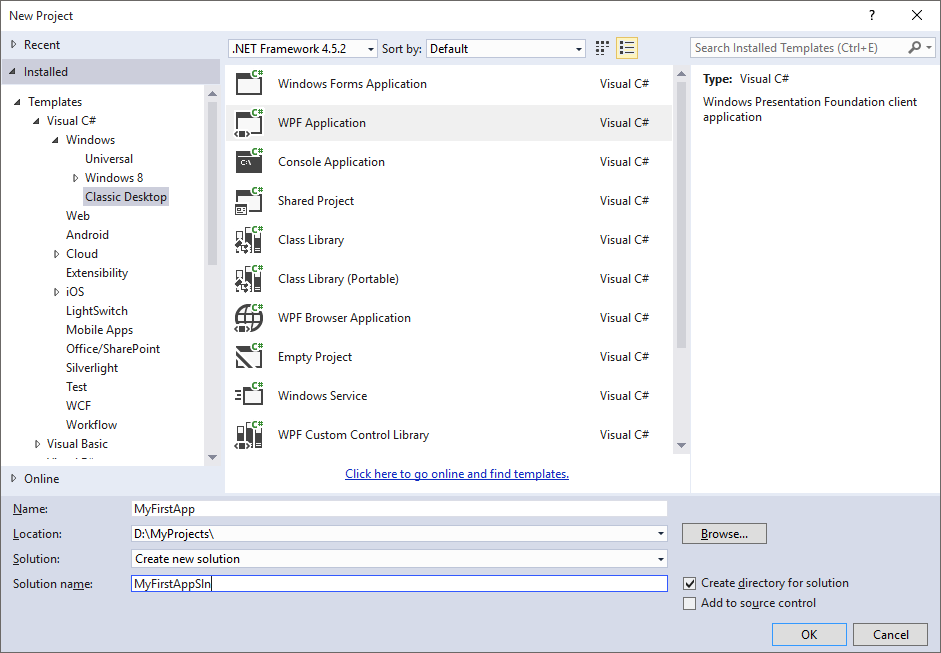
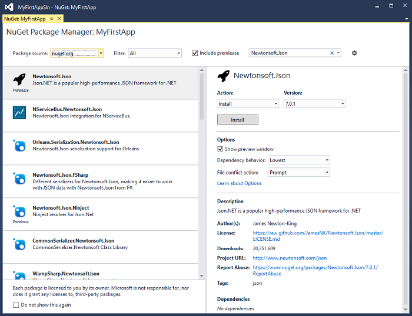
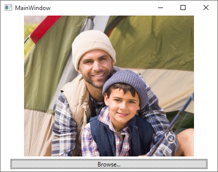
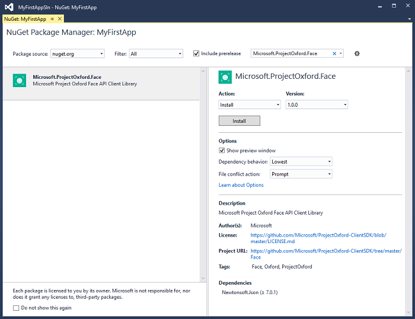
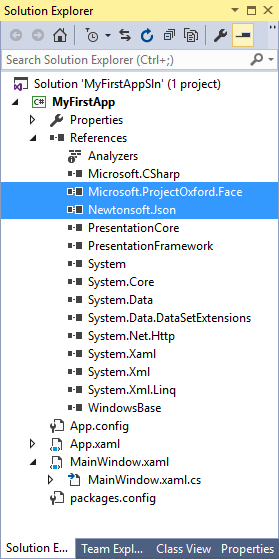

<!-- 
NavPath: Face API/Getting Started
LinkLabel: Getting Started With Face API in CSharp
Url: face-api/documentation/get-started-with-face-api/GettingStartedwithFaceAPIinCSharp
Weight: 50
-->
# Getting Started with Face API in C&#35;

In this tutorial, you will learn to create and develop a simple Windows application that invokes the Face API to detect faces in an image; essentially by framing the faces.


## Table of Contents

- [Preparation](#Preparation)
- [Step 1: Subscribe for Face API and get your subscription key](#step1)
- [Step 2: Create the application framework](#step2)
- [Step 3: Configure the Face API client library](#step3)
- [Step 4: Upload images to detect faces](#step4)
- [Step 5: Mark faces in the image](#step5)
- [Summary](#summary)
- [Related Topics](#related)

## <a name="Preparation"></a>Preparation

To use the tutorial, you will need the following prerequisites:

- Make sure Visual Studio 2015 is installed.

## <a name="step1"></a>Step 1: Subscribe for Face API and get your subscription key

Before using any Face API, you must sign up to subscribe Face API of the Microsoft Project Oxford services. See [subscription and key management](https://www.projectoxford.ai/Subscription). Both primary and secondary key can be used in this tutorial.

## <a name="step2"></a>Step 2: Create the application framework

In this step you will create a Windows application project to implement the basic UI for picking up and displaying an image. Simply follow the instructions below: 

1. Open Visual Studio 2015.
2. From the File menu, click New and then Project.
3. In the New Project dialog box, click Visual C# &gt; Windows Desktop &gt; WPF Application. If you prefer, you can choose Visual Basic as well. 
4. Name the application _MyFirstApp_, check the 'Create directory for solution' checkbox, name the solution _MyFirstAppSln_, and then click OK. 

5. Locate the Solution Explorer, right click your project (MyFirstApp in this case) and then click **Manage NuGet Packages**.
6. In NuGet Package Manager window, select nuget.org as your Package Source, search for Newtonsoft.Json and install. 

7. Open MainWindow.xaml, and replace the existing code with the following code to create the window UI: 

        <Window x:Class="MyFirstApp.MainWindow"
                xmlns="http://schemas.microsoft.com/winfx/2006/xaml/presentation"       
                xmlns:x="http://schemas.microsoft.com/winfx/2006/xaml"        
                Title="MainWindow" Height="350" Width="450">        
            <Grid x:Name="BackPanel">    
                <Image x:Name="FacePhoto" Stretch="Uniform" Margin="0,0,0,30"/>        
                <Button x:Name="BrowseButton" Margin="20,5" Height="20"         
                        VerticalAlignment="Bottom" Content="Browse..."                
                        Click="BrowseButton_Click"/>                
            </Grid>    
        </Window>

8. Open MainWindow.xaml.cs, and insert the following code inside the MainWindow class for the 'Browse' button: 
        
        private void BrowseButton_Click(object sender, RoutedEventArgs e)
        {
            var openDlg = new Microsoft.Win32.OpenFileDialog();
        
            openDlg.Filter = "JPEG Image(*.jpg)|*.jpg";
            bool? result = openDlg.ShowDialog(this);
        
            if (!(bool)result)
            {
                return;
            }
        
            string filePath = openDlg.FileName;
        
            Uri fileUri = new Uri(filePath);
            BitmapImage bitmapSource = new BitmapImage();
        
            bitmapSource.BeginInit();
            bitmapSource.CacheOption = BitmapCacheOption.None;
            bitmapSource.UriSource = fileUri;
            bitmapSource.EndInit();
        
            FacePhoto.Source = bitmapSource;
        }

Now your app can browse for a photo and display it in the window similar to the image below: 


## <a name="step3"></a>Step 3: Configure the Face API client library

Face API is a cloud API which is invoked by HTTPS requests. For a more convenient using Face API in .NET platform applications, a client library is also provided to encapsulate the web requests. In this example, we use the client library to simplify our work. 
Follow the instructions below to configure the client library: 

1. Locate the Solution Explorer, right click your project (MyFirstApp in this case) and then click Manage NuGet Packages. 
2. In NuGet Package Manager window, select nuget.org as your Package Source, search for Microsoft.ProjectOxford.Face and install.  
  
3. Check your project reference, Microsoft.ProjectOxford.Face will be automatically added after the installation succeed.

4. Open MainWindow.xaml.cs in your MyFirstApp project, add this using directive to the beginning of the file: 
        using Microsoft.ProjectOxford.Face; 
        using Microsoft.ProjectOxford.Face.Contract;   
5. Insert the following code in the MainWindow class: 
        private readonly IFaceServiceClient faceServiceClient = new FaceServiceClient("_Your subscription key_"); 
   Please set the subscription key obtained from step 1.
6. Now you are ready to call the Face API from your application. 

## <a name="step4"></a>Step 4: Upload images to detect faces

The most straightforward way to detect faces is by calling the [Face - Detect](https://dev.projectoxford.ai/docs/services/563879b61984550e40cbbe8d/operations/563879b61984550f30395236) API by uploading the image file directly.
When using the client library, this can be done by using an asynchronous method DetectAsync of FaceServiceClient.
Each returned face contains a rectangle to indicate its location, combined with a series of optional face attributes.
In this example, we only need to retrieve the face location. Here we need to insert an asynchronous function into the MainWindow class for face detection: 
```CSharp
private async Task<FaceRectangle[]> UploadAndDetectFaces(string imageFilePath)
{
    try
    {
        using (Stream imageFileStream = File.OpenRead(imageFilePath))
        {
            var faces = await faceServiceClient.DetectAsync(imageFileStream);
            var faceRects = faces.Select(face => face.FaceRectangle);
            return faceRects.ToArray();
        }
    }
    catch (Exception)
    {
        return new FaceRectangle[0];
    }
}
```

## <a name="step5"></a>Step 5: Mark faces in the image

In this last step, we combined all the above steps together and marked the detected faces in the image. First, open MainWindow.xaml.cs and add the 'async' modifier to the BrowseButton_Click method: 
```csharp
private async void BrowseButton_Click(object sender, RoutedEventArgs e)
```
Secondly, insert the following code below at the end of the BrowseButton_Click event handler: 
```csharp
Title = "Detecting...";
FaceRectangle[] faceRects = await UploadAndDetectFaces(filePath);
Title = String.Format("Detection Finished. {0} face(s) detected", faceRects.Length);

if (faceRects.Length > 0)
{
    DrawingVisual visual = new DrawingVisual();
    DrawingContext drawingContext = visual.RenderOpen();
    drawingContext.DrawImage(bitmapSource,
        new Rect(0, 0, bitmapSource.Width, bitmapSource.Height));
    double dpi = bitmapSource.DpiX;
    double resizeFactor = 96 / dpi;

    foreach (var faceRect in faceRects)
    {
        drawingContext.DrawRectangle(
            Brushes.Transparent,
            new Pen(Brushes.Red, 2),
            new Rect(
                faceRect.Left * resizeFactor,
                faceRect.Top * resizeFactor,
                faceRect.Width * resizeFactor,
                faceRect.Height * resizeFactor
                )
        );
    }

    drawingContext.Close();
    RenderTargetBitmap faceWithRectBitmap = new RenderTargetBitmap(
        (int)(bitmapSource.PixelWidth * resizeFactor),
        (int)(bitmapSource.PixelHeight * resizeFactor),
        96,
        96,
        PixelFormats.Pbgra32);

    faceWithRectBitmap.Render(visual);
    FacePhoto.Source = faceWithRectBitmap;
}
```

Run this application and browse for an image containing a face. Please wait for a few seconds to allow the cloud API to respond. After that, you will get a result similar to the image below: 


## <a name="summary"></a> Summary

In this tutorial, you have learned the basic process for using the Face API and created an application to display face marks in images. For more information on API details, please refer to the [How-To](../Face-API-How-to-Topics/Home.md) and [API Reference](https://dev.projectoxford.ai/docs/services/563879b61984550e40cbbe8d/operations/563879b61984550f30395236). 

## <a name="related"></a> Related Topics

[Getting Started with Face API in Java for Android](GettingStartedwithFaceAPIinJavaforAndroid.md)
