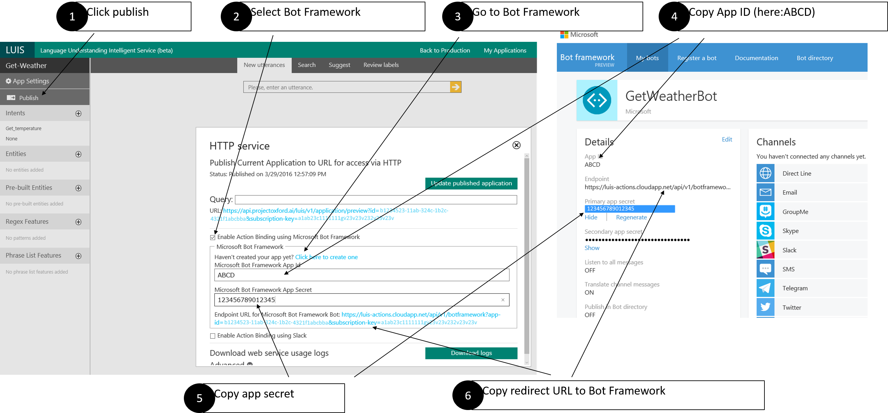

<!-- NavPath: PublishingToBot
LinkLabel: Publishing to a Bot
Url: LUIS-api/documentation/PublishingToABot
Weight: 70 -->

#Slack / Microsoft Bot Framework Integration

There are new options available for publishing LUIS models. These options allow the user to access the language model via various communication channels. The user is able to articulate an intent on Slack, via SMS or email and use this connection to trigger a bound action, for example to get temperature or current news. The result of the called action will show up in the communication channel. Currently, LUIS is offering integration with: 

 * Microsoft Bot Framework
 * Slack

The Slack integration is a direct integration with a Slack bot while the Microsoft Bot Framework wraps around several other communication channels including Slack. 

###Using the Microsoft Bot Framework

The Microsoft Bot Framework enables developers to build and connect intelligent bots to ineract with users no matter which device they are on or which technology they are using, for example Skype text/sms, Slack, Office365 mail and many other popular services. In combination with LUIS the developer can use the Bot Framework to enable triggering actions via any popular communication channel in an easy way. The developer simply has to create a new bot in the MS Bot Framework and then configure LUIS the right way to enable calling one service to the other. 

Setting up a bot in the MS Bot Framework in a few steps (see above screenshot): 

1. When you click **Publish** in the upper left-hand corner of the LUIS Application Editor workspace, you will get to a dialog box.
2. In this dialog you can select “Enable Action binding using Microsoft Bot Framework”.
3. The link in the field brings you to the webpage where you can create your bot. You can register a new bot right there.
4. When this is done, copy the App ID from the Microsoft Bot Framework to your LUIS application.
5. Copy the App secret into the correct field in the LUIS publish dialog box as well.
6. Finally, copy over the redirect URL provided by LUIS to your app on Microsoft Bot Framework. Unfortunately, you need this URL already during the registration step.

When this configuration is done and the application is correctly created within the Bot Framework, there are additional steps required to enable various channels depending on your preferences. Follow the instructions on Microsoft Bot Framework, if you want to enable SMS, Slack or other services. 

###Using the direct Slack connection

Slack is a communication platform for teams and it is getting more and more traction. For LUIS action binding we are providing a Slack bot connector which you can configure with a few clicks to make it available for your teams. You just have to configure it in a way so LUIS can talk to your bot. The configuration is handling all handshaking for you. 

Setting up a Slack bot in a few steps (see above screenshot): 
1. When you click **Publish** in the upper left-hand corner of the LUIS Application Editor workspace, you will get to a dialog box.
2. In this dialog you can select “Enabling Action binding using Slack”.
3. The link in the field brings you to Slack where you can create your Slack app and bot.You can create your app right there.
4. When this is done, copy the client ID from your new Slack app over to your LUIS application in the publish dialog box.
5. Copy the App secret into the correct field in the LUIS publish dialog box as well. This enables Slack to call LUIS and make use of its language understanding capabilities.
6. Finally, copy over the redirect URL provided by LUIS to your Slack app. This enables your app to call the bound actions on LUIS.

When this configuration is done and the application is correctly created in Slack you can use a bot within your team or group conversation. Just try a few utterances and see if the bot replies to you. 

