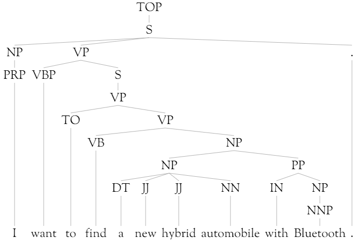

# Constituency Parsing

The goal of constituency parsing (also known as "phrase structure parsing") is to identify the phrases in the text.
This can be useful when extracting information from text.
Customers might want to find feature names or key phrases from a big body of text, and to see the modifiers and actions surrounding each such phrase.

## Phrases

To a linguist, a *phrase* is more than just a sequence of words.
To be a phrase, a group of words has to come together to play a specific role in the sentence.
That group of words can be moved together or replaced as a whole, and the sentence should remain fluent and grammatical.

Consider the sentence

> I want to find a new hybrid automobile with Bluetooth.

This sentence contains the noun phrase: "a new hybrid automobile with Bluetooth".
How do we know that this is a phrase?
We can rewrite the sentence (somewhat poetically) by moving that whole phrase to the front:

> A new hybrid automobile with Bluetooth I want to find.

Or we could replace that phrase with a phrase of similar function and meaning, like "a fancy new car":

> I want to find a fancy new car.

If instead we picked different subset of words, these replacement tasks would lead to strange or unreadable sentences.
Consider what happens when we move "find a new" to the front:

> Find a new I want to hybrid automobile with Bluetooth.

The results is very difficult to read and understand.

The goal of a parser is to find all such phrases.
Interestingly, in natural language, the phrases tend to be nested inside one another.
A natural representation of these phrases is a tree, such as the following:

In this tree, the branches marked "NP" are noun phrases.
There are several such phrases: *I*, *a new hybrid automobile*, *Bluetooth*, and *a new hybrid automobile with Bluetooth*.

## Phrase Types

| Label | Description | Example |
|-------|-------------|---------|
|S	| Sentence or clause. |
|SBAR	| Clause introduced by a (possibly empty) subordinating conjunction. |
|SBARQ	| Direct question introduce by a wh-word or wh-phrase. |
|SINV	| Inverted declarative sentence. |
|SQ	| Inverted yes/no question, or main clause of a whquestion. |
|ADJP	| Adjective Phrase. |
|ADVP	| Adverb Phrase. |
|CONJP	| Conjunction Phrase. |
|FRAG	| Fragment. |
|INTJ	| Interjection. |
|LST	| List marker. Includes surrounding punctuation.|
|NAC	| Not A Constituent; use within an NP.|
|NP	| Noun Phrase.|
|NX	| Used within certain complex NPs to mark the head.|
|PP	| Prepositional Phrase.|
|PRN	| Parenthetical.|
|PRT	| Particle.|
|QP	| Quantity Phrase (i.e., complex measure/amount) within NP.|
|RRC	| Reduced Relative Clause.|
|UCP	| Unlike Coordinated Phrase.|
|VP	| Verb Phrase.|
|WHADJP	| Wh-adjective Phrase, as in how hot.|
|WHADVP	| Wh-adverb Phrase.|
|WHNP	| Wh-noun Phrase, e.g. who, which book, whose daughter , none of which, or how many leopards.|
|WHPP	| Wh-prepositional Phrase, e.g., of which or by whose authority.|
|X	| Unknown, uncertain, or unbracketable.|

