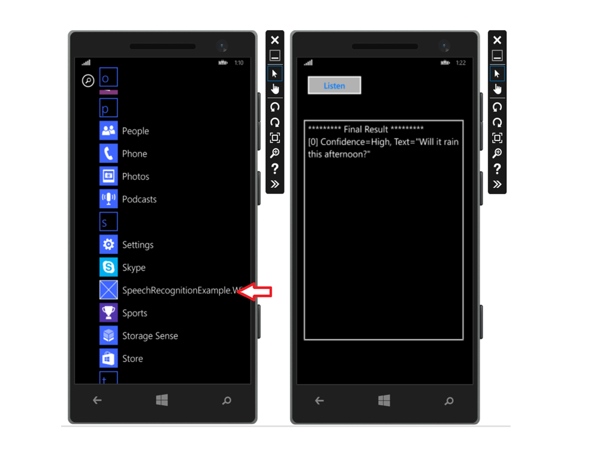

<!-- 
NavPath: Speech API/Get Started with Speech API
LinkLabel: Get started with Speech Recognition in C Sharp for .Net on Windows Phone 8.1
Url: Speech-api/documentation/GetStarted/Get-Started-CSharp-WinPhone
Weight: 90
-->

# Get started with Speech Recognition in C&#35; for .Net on Windows Phone 8.1

Develop a basic Windows Phone 8.1 application that uses the [Windows.Media.SpeechRecognition API Client Library](https://msdn.microsoft.com/en-us/library/windows.media.speechrecognition.aspx) to convert spoken audio input into text by sending audio to Microsoft’s servers in the cloud. Alternatively, you have the choice of using a REST API, which requires batching all of your audio into a single buffer, uploading the entire audio buffer, and getting recognition text results back. Documentation for the REST API can be found [here](../API-Reference-REST/Home.md) and code samples [here](https://oxfordportal.blob.core.windows.net/speech/doc/recognition/Program.cs). 

Using the Windows.Media.SpeechRecognition API Client Library allows for real-time streaming, which means that at the same time your client application sends audio to the service, it simultaneously and asynchronously receives partial recognition results back. This tutorial describes the use of the [Windows.Media.SpeechRecognition API Client Library](https://msdn.microsoft.com/en-us/library/windows.media.speechrecognition.aspx). 

###Table of Contents
* [Prerequisites](#Prerequisites)
* [Step 1: Install the example application](#Step1)
* [Step 2: Build the example application](#Step2)
* [Step 3: Run the example application](#Step3)
* [Review and Learn](#Review)   
* [Summary remarks](#Summary)
* [Related topics](#Related)

###<a name="Prerequisites">Prerequisites</a>

* #### Platform requirements
The below example has been developed for the .NET Framework using [Visual Studio 2015, Community Edition](https://www.visualstudio.com/products/visual-studio-community-vs). 

* #### Access the client library and download the example
You can access the Windows Media Speech Recognition Client Library through this [link](https://msdn.microsoft.com/en-us/library/windows.media.speechrecognition.aspx) and you may download the example application for a Windows Phone 8.1 Universal project [here](https://github.com/Microsoft/ProjectOxford-ClientSDK/tree/master/Speech). 
The downloaded zip file needs to be extracted to a folder of your choice, many users choose the Visual Studio 2015 folder. You may also need to download the Windows Phone tools, which is an optional add-on to Visual Studio, if it is not already installed.

* #### Subscribe to Speech API and get a free trial subscription key 
Before creating the example, you must subscribe to Speech API which is part of Project Oxford services. For subscription and key management details, see [Subscription](https://www.microsoft.com/cognitive-services/en-us/sign-up). Both the primary and secondary key can be used in this example. 

###<a name="Step1">Step 1: Install the Windows Phone 8.1 example application</a>
1.	Start Microsoft Visual Studio 2015 and click **File**, select **Open**, then **Project/Solution**.
2.	Browse to the folder where you saved the downloaded **SpeechRecognitionExample.WindowsPhone8.1** files. Click to open the **SpeechRecognitionExample.WindowsPhone8.1** folder.
3.	Double-click to open the Visual Studio 2015 Solution (.sln) file named **SpeechRecognitionExample.WindowsPhone8.1.sln**. This will open the solution in Visual Studio.

###<a name="Step2">Step 2: Build the example application</a>
1.	Press Ctrl+Shift+B, or click **Build** on the ribbon menu, then select **Build Solution**. 
2.	Note, you may have to specifically add the **SpeechRecognitionExample.WindowsPhone8.1.csproj** file to the solution, if it does not run automatically. The .csproj file can be found in the same folder as SpeechRecognitionExample.WindowsPhone8.1.sln.

###<a name="Step3">Step 3: Run the example application</a>
1.	Before running the example application, you need to decide whether to use a device or a phone emulator for running your example application. If you choose the emulator, make sure your system allows virtualization* and has virtualization software such as Hyper-V installed to simulate the phone hardware. (*Virtualization is turned off by default in Windows 8, Windows 8.1, and Windows 10.)
2.	Click **Start** on the ribbon menu to select **Device** or one of the **Emulators** to run the example.  
3.	Locate the **Windows Phone** window or your chosen device, and scroll the apps. You should find the **Speech Recognition Example** under “S”.



4.	Tap the app to open it.  A simple user interface opens. Tap the “Listen” button and speak a sentence or two. (Make sure the microphone is on.)  The spoken audio should be returned as text and appear in the square window immediately after your speech. A confidence level accompanies the returned text.

###<a name="Review">Review and Learn</a>
One SpeechRecognizer object can be used for multiple recognition sessions.
(BH comment: Suggest adding the preceding line of code which contains the async modifier:
 )

```
protected async override void OnNavigatedTo(NavigationEventArgs e)

```

A speech recognition session can be started by calling the SpeechRecognizer.RecognizeAsync method. This returns an IAsyncOperation< SpeechRecognitionResult > object, which provides the Completed event that is triggered upon completion of the recognition session. The session is terminated and the recognition results returned when a pause is detected by the recognizer. The results are passed as an argument to any handlers attached to the Completed event.

The results are available in a SpeechRecognitionResult object accessible through the arguments of the Completed event handler. This object provides n-best alternatives in decreasing order of quality (results with highest recognition confidence level is first followed by results with decreasing recognition confidence levels).

###<a name="Summary">Summary remarks</a>
In conclusion, this "Get started" introduction and the provided example application only illustrates basic functionality of the Windows Media Speech Recognition API. The API offers a rich set of features that we encourage you to explore through the API documentation on MSDN and further experimentation.

###<a name="Related">Related topics</a>
 * Get Started with Speech Recognition in C Sharp for .Net on Windows Desktop
 * Get started with Speech Recognition in C Sharp for .Net Universal Apps on Windows 10 (including Phone)
 * Get started with Speech Recognition and/or intent in Java on Android
 * Get started with Speech Recognition and/or intent in Objective C on iOS

