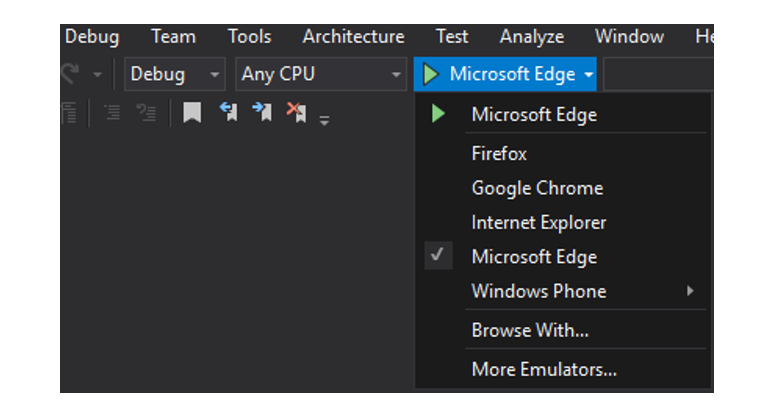
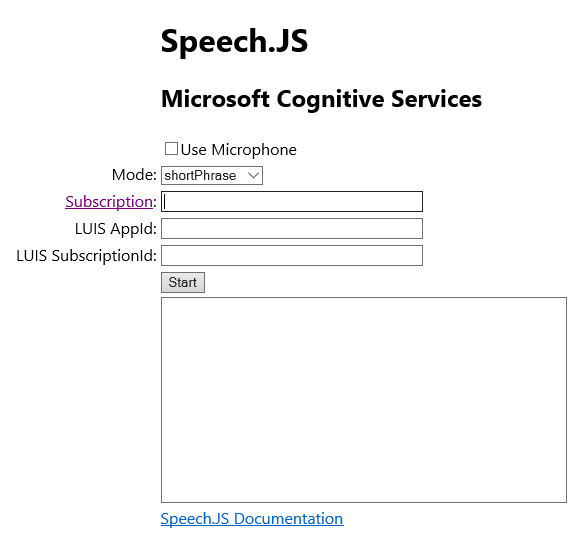

<!--
NavPath: Bing Speech API/Speech Recognition/REST API
LinkLabel: Get started in JavaScript
Url: Speech-api/documentation/GetStarted/GetStartedJS
Weight: 80
-->

#Get Started with Bing Speech API in JavaScript

With Bing Speech API you can develop basic JavaScript applications that leverage Microsoft’s cloud servers to convert spoken audio to text. This article describes an example web application created in Visual Studio 2015 that demonstrates the use of Bing Speech API using Javascript.

The Speech Recognition example demonstrates the following features using a wav file or external microphone input:
 * Short-form recognition
 * Recognition with intent

To use Speech.JS, simply host Speech.1.0.0.js on your website. A 'minified' version of Speech.JS is also available Speech.1.0.0.min.js.

### Table of Contents
*	[Prerequisites](#Prerequisites)
*	[Step 1: Install the Example Application](#Step1)
*	[Step 2: Build the Example Application](#Step2)
*	[Step 3: Run the Example Application](#Step3)
*	[Related Topics](#Related)

## Prerequisites

#### Platform requirements
The below example has been developed for the .NET Framework using [Visual Studio 2015, Community Edition](https://www.visualstudio.com/products/visual-studio-community-vs).

#### Get the client library and example
You may download the Speech API client library and example through  [GitHub](https://github.com/Microsoft/Cognitive-Speech-STT-JavaScript). The downloaded folder needs to be hosted locally on your machine to follow the below scenario.

#### Subscribe to Speech API and get a free trial subscription key
Before creating the example, you must subscribe to Speech API which is part of Microsoft Cognitive Services (previously Project Oxford). For subscription and key management details, see [Subscriptions](https://www.microsoft.com/cognitive-services/en-us/sign-up). Both the primary and secondary key can be used in this tutorial.

## Step 1: Install the Example Application</a>
1.	Start Microsoft Visual Studio 2015 and click **File**, select **Open**, then **Project/Solution**.
2.	Browse to the folder where you saved the downloaded Speech.JS files. Click on **Speech** and then the **Speech.JS**folder.
3.	Double-click to open the Visual Studio 2015 Solution (.sln) file named **Oxford.Speech.JS.sln**. This will open the solution in Visual Studio.

## Step 2: Build the Example Application
1.	Press Ctrl+Shift+B, or click **Build** on the ribbon menu, then select **Build Solution**.

## Step 3: Run the Example Application
1.	After the build is complete, choose the target browser you would like to use for running your Speech-to-Text web app.

2.	Press **F5** or click **Start** on the ribbon menu to run the example.
3.	Locate the **Cognitive Services Speech to Text** window with the **text edit box** reading **"Subscription"**. Paste your subscription key into the text box as shown in below screenshot.

4. Check if you would like to use the Microphone as your voice input and what speech mode you would like to use by selecting a setting in the "Mode" drop-down box.
5. For modes where you would like both Speech Recognition and Intent to work together, you need to first sign up for [Language Understanding Intelligent Service (LUIS)](https://www.luis.ai/), then set the key values in the fields "LUIS AppID" and "LUIS SubscriptionId".

## Related Topics 
* [Get Started with Bing Speech Recognition in C Sharp for .Net on Windows Desktop](GetStartedCSharpDesktop.md)
* [Get Started with Bing Speech Recognition in C Sharp for .Net on Windows Phone 8.1](GetStartedCSharpWinPhone.md)
* [Get started with Bing Speech Recognition and/or intent in Java on Android](GetStartedJavaAndroid.md)
* [Get started with Bing Speech Recognition and/or intent in Objective C on iOS](Get-Started-ObjectiveC-iOS.md)
* [Get started with Bing Speech API in cURL](GetStarted-cURL.md)

For questions, feedback, or suggestions about Microsoft Cognitive Services, feel free to reach out to us directly.

* Cognitive Services [UserVoice Forum](https://cognitive.uservoice.com/)

#### License

All Microsoft Cognitive Services SDKs and samples are licensed with the MIT License. For more details, see [LICENSE](https://github.com/Microsoft/Cognitive-Speech-STT-JavaScript/blob/master/LICENSE.md).

