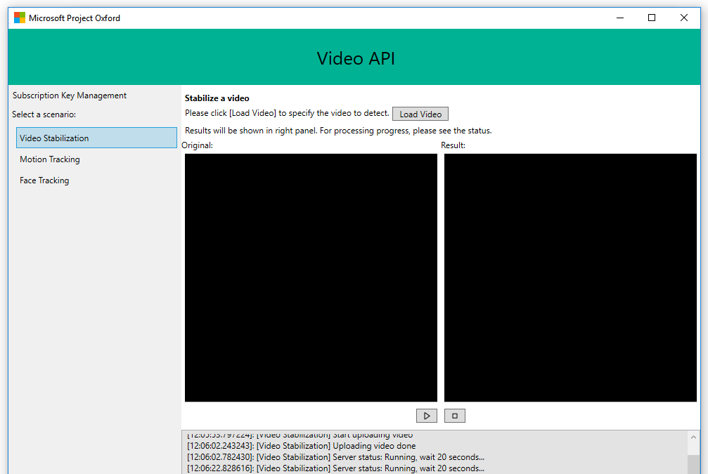
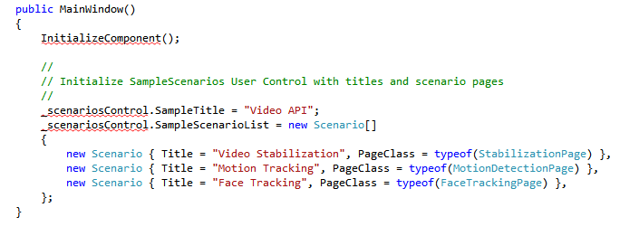

<!-- 
NavPath: Video API
LinkLabel: Get Started with Video API in C#
Url: Video-api/documentation/Get-Started
Weight: 95
-->

# Get Started with Video API in C&#35;

Explore a basic Windows application that uses Microsoft Cognitive Services (formerly Project Oxford) Video API to stabilize videos, recognize motion tracking and detecting faces in a video. The below example lets you submit a locally stored file in mp4, mov, or wmv formats. You can use this open source example as a template for building your own app for Windows using the Video API and WPF (Windows Presentation Foundation), a part of .NET Framework.

## Table of Contents
* 	[Prerequisites](#Prerequisites)
* 	[Step 1: Install the example](#Step1)
* 	[Step 2: Build the example](#Step2)
* 	[Step 3: Run the example](#Step3)
* 	[Review Summary](#Review)   
* 	[Related Topics](#Related)  

## <a name="Prerequisites">Prerequisites</a>  
#### Platform requirements
  The below example has been developed for the .NET Framework using [Visual Studio 2015, Community Edition](https://www.visualstudio.com/products/visual-studio-community-vs).  
#### Subscribe to Video API and get a subscription key 
  Before creating the example, you must subscribe to Video API which is part of Microsoft Cognitive services. For subscription and key management details, see [Subscriptions](https://www.microsoft.com/cognitive-services/en-us/sign-up). Both the primary and secondary key can be used in this tutorial. Make sure to follow best practices for keeping your API key secret and secure. 
#### Get the client library and example
  You may download the Video API client library and example via [GitHub](https://github.com/Microsoft/ProjectOxford-ClientSDK/tree/master/Video/Windows). The downloaded zip file needs to be extracted to a folder of your choice, many users choose the Visual Studio 2015 folder.

## <a name="Step1">Step 1: Install the example</a>
1.	Start Microsoft Visual Studio 2015 and click **File**, select **Open**, then **Project/Solution**.

2.	Browse to the folder where you saved the downloaded Video API files. Click on **Video**, then **Windows**, and then the **Sample-WPF** folder.
3.	Double-click to open the Visual Studio 2015 Solution (.sln) file named **VideoAPI-WPF-Samples.sln**. This will open the solution in Visual Studio.

## <a name="Step2">Step 2: Build the example</a>  
1.	In **Solution Explorer** you will find that the solution consists of three projects, **SampleUserControlLibrary, VideoSDK (Portable)** and **VideoAPI-WPF-Samples**. Right-click **VideoAPI-WPF_Samples** and in the pop-up menu locate and select “**Set as StartUp Project**”.

2.	Press Ctrl+Shift+B, or click **Build** on the ribbon menu, then select **Build Solution**.

## <a name="Step3">Step 3: Run the example</a>
1.	After the build is complete, press **F5** or click **Start** on the ribbon menu to run the example.  
2.	Locate the window with the **text edit box** reading "**Paste your subscription key here to start**" as shown in below screenshot. Paste your subscription key into the text box. You can choose to persist your subscription key on your PC or laptop by clicking the "**Save Key**" button. When you want to delete the subscription key from the system, click "**Delete Key**" to remove it from your PC or laptop.

3.	Under "**Select Scenario**" click to use either of the three scenarios, “**Video Stabilization**”, “**Motion Tracking**” or “**Face Detection**”. 

  

4.	Click the “**Load Video**” button to browse to a video file stored on your PC, laptop or local network. Video must be in mp4, mov, or wmv format. Expect to wait a minute or two for the file to load.
  * **Video stabilization:** Click the rectangular start button to run your video. Your original video will run in the left window and a stabilized version in the right window.
  * **Motion Tracking:** Original video will run in the left window. If motion is detected, a red rectangle will frame your video. In the right window, Json will be displayed indicating the region (at this point there is only one, the entire frame) and duration of movements.
  * **Face Detection:** Original video will run in the left window. If or when faces are detected, Json coordinates (left, top, width, and height) are returned in the right window indicating the location of faces in the video in pixels, as well as a face ID indicating the tracking number of the person. If no human faces are detected, it will be indicated as "FacesDetected": null.
  * **Lower horizontal window:** Progress during loading and recognition will be displayed in real time.  
5. Microsoft receives the videos you upload and may use them to improve Video API and related services. By submitting a video, you confirm that you have followed our [Developer Code of Conduct](http://go.microsoft.com/fwlink/?LinkId=698895).

## <a name="Review">Review summary</a>

  
Code snippets with suggestions on how to extend and and customize your video app, coming in the near future. Check back soon!   
## <a name="Related">Related topics</a>
* Emotion API
* Face API
* Computer Vision API

